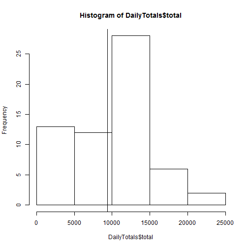
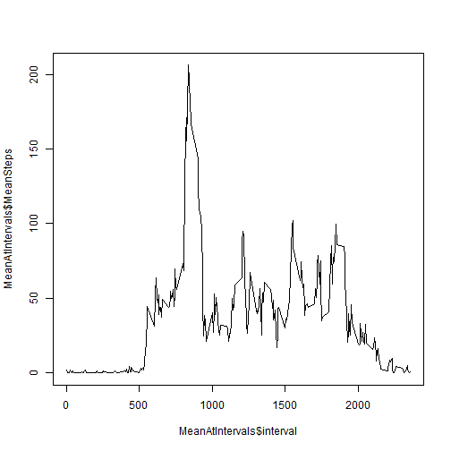
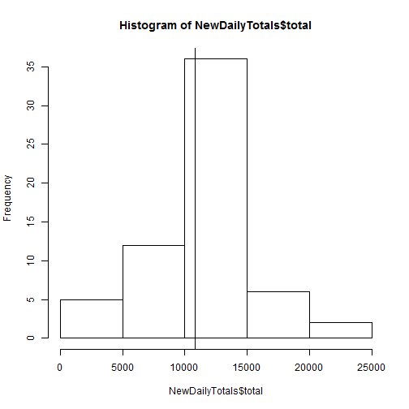
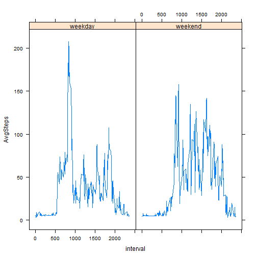

## Loading and preprocessing the data
We must first set our working directory, unzip the data, and then load it.

```r
setwd("~/GitHub/RepData_PeerAssessment1")
unzip("activity.zip")
ActivityData<-read.csv(file="activity.csv")
```

For much of what is to come, I intend to use `dplyr` to manipulate the data, and so I load it now and convert the dataframe to a `tbl_df` which will allow us to get a nice preview of the data as well.


```r
library(dplyr)
ActivityData<-tbl_df(ActivityData)
ActivityData
```

```
## Source: local data frame [17,568 x 3]
## 
##    steps       date interval
## 1     NA 2012-10-01        0
## 2     NA 2012-10-01        5
## 3     NA 2012-10-01       10
## 4     NA 2012-10-01       15
## 5     NA 2012-10-01       20
## 6     NA 2012-10-01       25
## 7     NA 2012-10-01       30
## 8     NA 2012-10-01       35
## 9     NA 2012-10-01       40
## 10    NA 2012-10-01       45
## ..   ...        ...      ...
```
We see there are three variables, `steps,date,interval` with lots of `NA`.

## What is mean total number of steps taken per day?
We start by calculating the mean total number of steps per day. To for ease of understanding, we will make use of `dplyr` to `summarise` the data grouped by `date` to first find the total in each day, which we will store in a new `data.frame` called `DailyTotals`.


```r
DailyTotals<-ActivityData %>%
     group_by(date) %>%
     summarise(total=sum(steps,na.rm=TRUE))
DailyTotals
```

```
## Source: local data frame [61 x 2]
## 
##          date total
## 1  2012-10-01     0
## 2  2012-10-02   126
## 3  2012-10-03 11352
## 4  2012-10-04 12116
## 5  2012-10-05 13294
## 6  2012-10-06 15420
## 7  2012-10-07 11015
## 8  2012-10-08     0
## 9  2012-10-09 12811
## 10 2012-10-10  9900
## ..        ...   ...
```

Now that we have the `DailyTotals` we can simply take the mean.


```r
DailyMean<-mean(DailyTotals$total)
DailyMean
```

```
## [1] 9354.23
```
We see that the mean number of total steps taken each day is 9354.2295082

In order to get a feeling for how the number of steps vary daily, we will make a histogram of the `DailyTotals$total` data. In addition, we add a vertical line at the mean value.

```r
hist(DailyTotals$total)
abline(v=DailyMean)
```

 

The mean of a dataset can be greatly influenced by days of abnormally high or abnormally low data values. As a result, we will also consider the median of this data.


```r
DailyMedian<-median(DailyTotals$total)
DailyMedian
```

```
## [1] 10395
```

In this case, we see that the median of 10395 is a bit higher than the mean of 9354.2295082.

## What is the average daily activity pattern?
People tend to do different things throughout the day. To investigate how many steps, on average, occurs throughout the day, we compute the daily average per time interval. Again, `dplyr` is useful to `group_by` the `interval` and take a mean. We preview the data as well.

```r
MeanAtIntervals<-ActivityData %>%
     group_by(interval) %>%
    summarise(MeanSteps=mean(steps,na.rm=TRUE))
MeanAtIntervals
```

```
## Source: local data frame [288 x 2]
## 
##    interval MeanSteps
## 1         0 1.7169811
## 2         5 0.3396226
## 3        10 0.1320755
## 4        15 0.1509434
## 5        20 0.0754717
## 6        25 2.0943396
## 7        30 0.5283019
## 8        35 0.8679245
## 9        40 0.0000000
## 10       45 1.4716981
## ..      ...       ...
```
For a visual display, we will make a time series plot.


```r
plot(x=MeanAtIntervals$interval,y=MeanAtIntervals$MeanSteps,type="l")
```

 

By looking at the plot, we see there is a failry clearly maximum average point which we will now locate.


```r
MaxMeanInterval<-MeanAtIntervals[which.max((MeanAtIntervals$MeanSteps)),]
MaxMeanInterval
```

```
## Source: local data frame [1 x 2]
## 
##   interval MeanSteps
## 1      835  206.1698
```

We determine the maximum mean steps is 206.1698113 which occurs at the interval 835.


## Imputing missing values
Our original dataset contains lots of missing values for steps. In fact, few can calculate how many exactly. We will simply count the number of rows in the subset of data that have at least one missing value.


```r
NumNAs<-nrow(ActivityData[!complete.cases(ActivityData)])
NumNAs
```

```
## [1] 17568
```
From this calculatuation, we see a total of 17568 contain missing values.


If we assume that, on average, a person's distribution of steps is somewhat consistent each day, we can impute the missing values using the values we do know. We first make use of the dataset we already calculated called `MeanAtIntervals`.


There is a really cool function called `ifelse` that we can use to create a new value `ImputedSteps` which is either the actual steps or the average steps based on `NA`.


```r
ImputedActivityData<-ActivityData %>%
     mutate(ImputedSteps=ifelse(is.na(steps),MeanAtIntervals$MeanSteps[interval],steps))
```

Lets examine the output of this by comparing the dataset `ImputedActivityData` with `ActivityData` first by looking at 5 of the cases where we knew the value.


```r
ImputedActivityData[complete.cases(ActivityData),][650:655,]
```

```
## Source: local data frame [6 x 4]
## 
##   steps       date interval ImputedSteps
## 1    18 2012-10-04      605           18
## 2    20 2012-10-04      610           20
## 3    40 2012-10-04      615           40
## 4    36 2012-10-04      620           36
## 5    17 2012-10-04      625           17
## 6    49 2012-10-04      630           49
```

In this case, we see the `steps` value is equal to the `ImputedSteps`, which is a requirement for imputing. Now let us look at some which required imputation.


```r
ImputedActivityData[!complete.cases(ActivityData),][33:38,]
```

```
## Source: local data frame [6 x 4]
## 
##   steps       date interval ImputedSteps
## 1    NA 2012-10-01      240     26.81132
## 2    NA 2012-10-01      245     21.32075
## 3    NA 2012-10-01      250     23.45283
## 4    NA 2012-10-01      255           NA
## 5    NA 2012-10-01      300           NA
## 6    NA 2012-10-01      305           NA
```

Unforunately, we see that this new dataset also has some missing values shown as `Na`. This corresponds to the fact that there are some intervals for which we have no value on any day. So we will need to impute a second time, ensuring we do have a value. For simplicity, we will simply use the mean of the `steps` across our entire dataset we certainly know exists.


```r
MeanSteps<-mean(ActivityData$steps,na.rm=TRUE)
MeanSteps
```

```
## [1] 37.3826
```

```r
ImputedActivityData<-ImputedActivityData %>%
     mutate(ImputedSteps=ifelse(is.na(ImputedSteps),MeanSteps,ImputedSteps))
ImputedActivityData[!complete.cases(ActivityData),][33:38,]
```

```
## Source: local data frame [6 x 4]
## 
##   steps       date interval ImputedSteps
## 1    NA 2012-10-01      240     26.81132
## 2    NA 2012-10-01      245     21.32075
## 3    NA 2012-10-01      250     23.45283
## 4    NA 2012-10-01      255     37.38260
## 5    NA 2012-10-01      300     37.38260
## 6    NA 2012-10-01      305     37.38260
```

We displayed the same data where we say missing values before. We see these missing values are now filled in with the `MeanSteps` value of 37.3825996. Let us confirm there are no missing values by counting the number of missing values similar to how we did earlier.


```r
NumImputedNAs<-nrow(ImputedActivityData[is.na(ImputedActivityData$ImputedSteps),])
NumImputedNAs
```

```
## [1] 0
```

We are happy to see this value is now 0, indicating full imputation is done.

We will recalulate new daily totals, mean, and median for comparison. Notice this time we need not use the command `is.na()`


```r
NewDailyTotals<-ImputedActivityData %>%
     group_by(date) %>%
     summarise(total=sum(ImputedSteps))
NewDailyTotals
```

```
## Source: local data frame [61 x 2]
## 
##          date    total
## 1  2012-10-01 10871.91
## 2  2012-10-02   126.00
## 3  2012-10-03 11352.00
## 4  2012-10-04 12116.00
## 5  2012-10-05 13294.00
## 6  2012-10-06 15420.00
## 7  2012-10-07 11015.00
## 8  2012-10-08 10871.83
## 9  2012-10-09 12811.00
## 10 2012-10-10  9900.00
## ..        ...      ...
```

Now that we have the `NewDailyTotals` we can simply take the mean.


```r
NewDailyMean<-mean(NewDailyTotals$total)
NewDailyMean
```

```
## [1] 10783.43
```

Similarly, we can take the median.


```r
NewDailyMedian<-median(NewDailyTotals$total)
NewDailyMedian
```

```
## [1] 10905.36
```

We can easy see now that the former mean of 9354.2295082 has been replaced by the new mean of 1.078343 &times; 10<sup>4</sup>, which is higher. Moreover, the former median of 10395 has been replaced by the new median of 1.0905358 &times; 10<sup>4</sup> which is also higher. Note that the new values are displayed in scientific notation.

Let's graph a histogram of the new values too.

```r
hist(NewDailyTotals$total)
abline(v=NewDailyMean)
```

 

This new histogram shows the data has now shifted a bit toward the mean which makes sense since we used the means to replace missing values, making the mean more meaningful. (See what I did there? `HaHa`)


## Are there differences in activity patterns between weekdays and weekends?

People often exhibit different activity on weekends and weekdays. Lets do a simple exploration into this. First we will create a factor variable indicating if the date is a weekday or a weekend. We use the complete imputed data set for this.


```r
ImputedActivityData <- ImputedActivityData %>%
     mutate(day=weekdays(as.Date(date,'%Y-%m-%d')),wkday=ifelse(day %in% c("Saturday", "Sunday"), "weekend", "weekday"))
ImputedActivityData
```

```
## Source: local data frame [17,568 x 6]
## 
##    steps       date interval ImputedSteps    day   wkday
## 1     NA 2012-10-01        0    0.0754717 Monday weekday
## 2     NA 2012-10-01        5    1.4716981 Monday weekday
## 3     NA 2012-10-01       10    0.1509434 Monday weekday
## 4     NA 2012-10-01       15    0.1698113 Monday weekday
## 5     NA 2012-10-01       20    0.0000000 Monday weekday
## 6     NA 2012-10-01       25    0.1320755 Monday weekday
## 7     NA 2012-10-01       30    1.5471698 Monday weekday
## 8     NA 2012-10-01       35    0.0000000 Monday weekday
## 9     NA 2012-10-01       40    0.4905660 Monday weekday
## 10    NA 2012-10-01       45    0.9433962 Monday weekday
## ..   ...        ...      ...          ...    ...     ...
```

I will now aggregate the data based on these designations.

```r
WkndVsWkd<-ImputedActivityData %>%
     group_by(wkday,interval) %>%
     summarise(AvgSteps=mean(ImputedSteps))
WkndVsWkd
```

```
## Source: local data frame [576 x 3]
## Groups: wkday
## 
##      wkday interval AvgSteps
## 1  weekday        0 5.261146
## 2  weekday        5 3.531586
## 3  weekday       10 3.145842
## 4  weekday       15 3.286303
## 5  weekday       20 6.912416
## 6  weekday       25 8.990822
## 7  weekday       30 6.735896
## 8  weekday       35 5.816399
## 9  weekday       40 3.801724
## 10 weekday       45 5.808852
## ..     ...      ...      ...
```

I wil make use of the `lattice` package to plot the patterns on these two factors.

```r
library(lattice)
xyplot(AvgSteps ~ interval | wkday, data = WkndVsWkd,type="l")
```

 

Based on these graphs, you see the data does indeed seem to be different. The weekend actitivy seems to be fairly consistent, whereas on the weekday there seems to be more of an early morning spike.

Thank you for reading my project.

